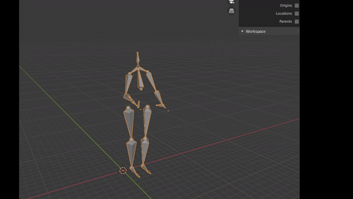

# About

H36M_to_BVH is a Python script for converting D3 Angles CDF files of the H36M dataset to common BVH files, which provide compatibility with applications like fairmotion or Blender.

The D3 Angles files can be retrieved after registration: http://vision.imar.ro/human3.6m/filebrowser.php

## Installation

Use the package manager [pip](https://pip.pypa.io/en/stable/) to install the cdflib.

```bash
pip install cdflib
```

## Usage

Param:  -h or --help : for printing the help message. \
Param:  -SkelScale=XX : Number which to divide the distance of all joints (default is set to 100). \
Param:  -srcFile=PATH_TO_FILE : file path to the cdf file of H36M D3 Angles.  \
Param:  -srcDir=PATH_TO_DIR : directory where multiple cdf files are (H36M D3 Angles).  \
Param:  -dest=PATH_TO_DIR : directory path for saving the bvh file.  \

Example usage: \
```python
python .\H36M_to_BVH.py -pose "C:/Users/.../D3_Angles/Directions 1.cdf" -dest "C:/Path/to/dest/"
```

## Blender Import Example
After converting the cdf into bvh files, blender should be able to automatically load the file by using the import function.




## License
[MIT](https://choosealicense.com/licenses/mit/)
